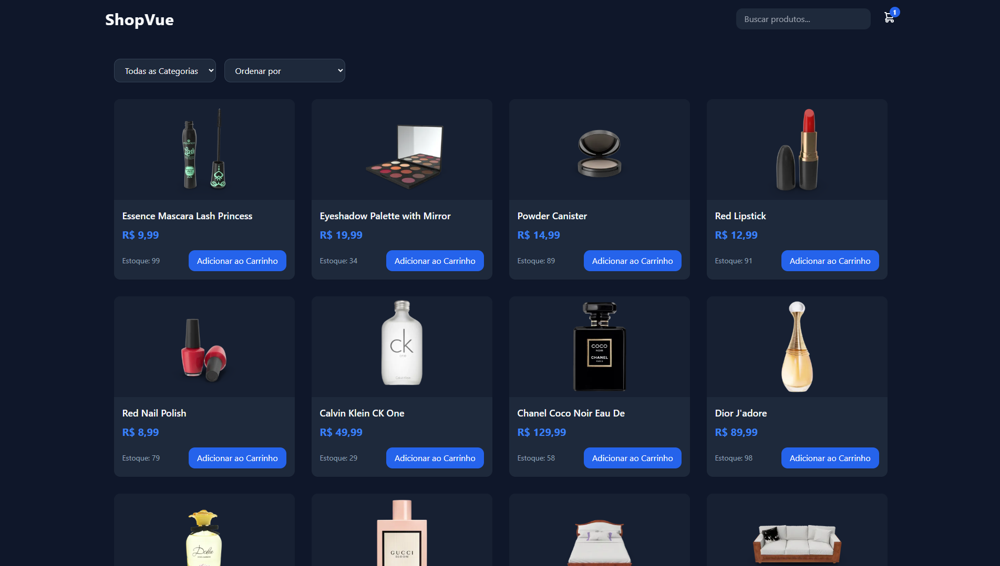
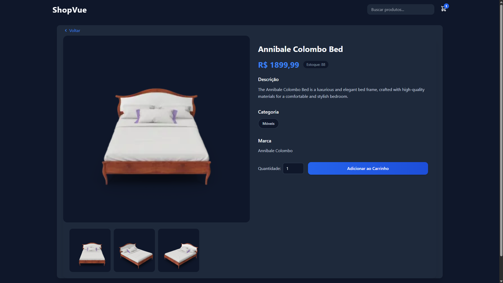
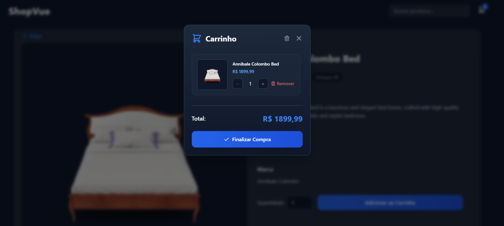
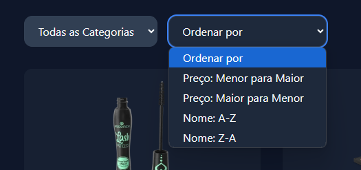

# ShopVue - E-commerce com Vue.js


## 📝 Descrição

ShopVue é uma aplicação de e-commerce moderna desenvolvida com Vue.js 3, Vite, Axios e TailwindCSS. A aplicação consome a API DummyJSON para exibir produtos, permitindo aos usuários navegar por categorias, buscar produtos, visualizar detalhes e gerenciar um carrinho de compras.

## ✨ Funcionalidades

- **Listagem de Produtos**
  - Grid responsivo de produtos
  - Exibição de nome, imagem, preço, categoria e estoque
  - Paginação para navegação entre produtos

- **Categorias**
  - Menu lateral com todas as categorias disponíveis
  - Filtragem de produtos por categoria
  - Navegação intuitiva

- **Busca de Produtos**
  - Busca em tempo real
  - Filtragem instantânea de produtos
  - Resultados atualizados conforme digitação

- **Detalhes do Produto**
  - Página dedicada com informações completas
  - Imagens em alta resolução
  - Descrição detalhada
  - Informações de estoque e preço

- **Carrinho de Compras**
  - Adição e remoção de produtos
  - Ajuste de quantidades
  - Cálculo automático do total
  - Persistência dos dados no localStorage
  - Confirmações com SweetAlert2

## 🚀 Tecnologias Utilizadas

- **Vue.js 3** - Framework JavaScript progressivo
- **Vite** - Build tool e servidor de desenvolvimento
- **TailwindCSS** - Framework CSS utilitário
- **Axios** - Cliente HTTP para requisições à API
- **Vue Router** - Roteamento oficial do Vue.js
- **SweetAlert2** - Biblioteca para alertas e confirmações

## 🛠️ Instalação e Execução

1. Clone o repositório:
```bash
git clone https://github.com/oandrecarvalho/ShopVue.git
cd ShopVue
```

2. Instale as dependências:
```bash
npm install
```

3. Execute o projeto em modo de desenvolvimento:
```bash
npm run dev
```

4. Para build de produção:
```bash
npm run build
```

## 📱 Screenshots

### Listagem de Produtos



### Detalhes do Produto


### Carrinho de Compras


### Busca e Categorias


## 🎥 Vídeo de Demonstração

[Link para o vídeo no YouTube](https://youtu.be/DbpQrc_BUDE)

## 👥 Autores

- [Luiz Henrique Costa](https://github.com/lorocks51987) - 1987381
- [André Luis Carvalho](https://github.com/oandrecarvalho) - 1996932

## 📄 Licença

Este projeto está sob a licença MIT. Veja o arquivo [LICENSE](LICENSE) para mais detalhes.

## 🙏 Agradecimentos

- [DummyJSON](https://dummyjson.com/) pela API de produtos
- [Vue.js](https://vuejs.org/) pelo framework incrível
- [TailwindCSS](https://tailwindcss.com/) pela estilização
- [Vite](https://vitejs.dev/) pela ferramenta de build 
